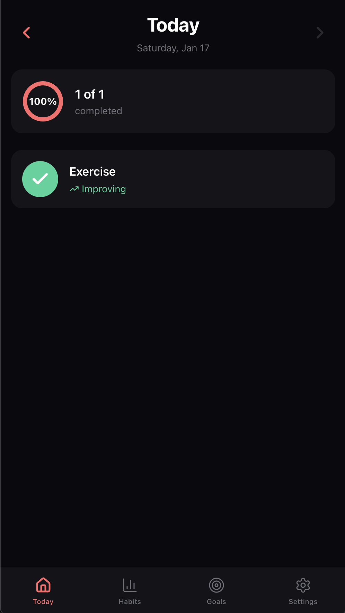
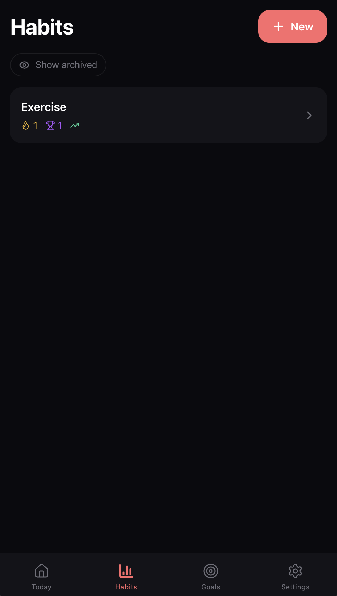
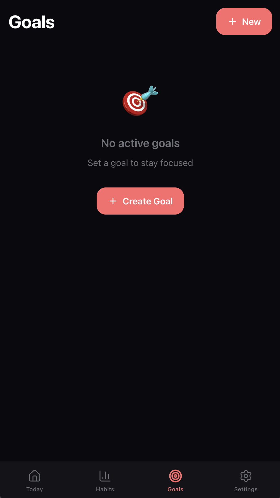
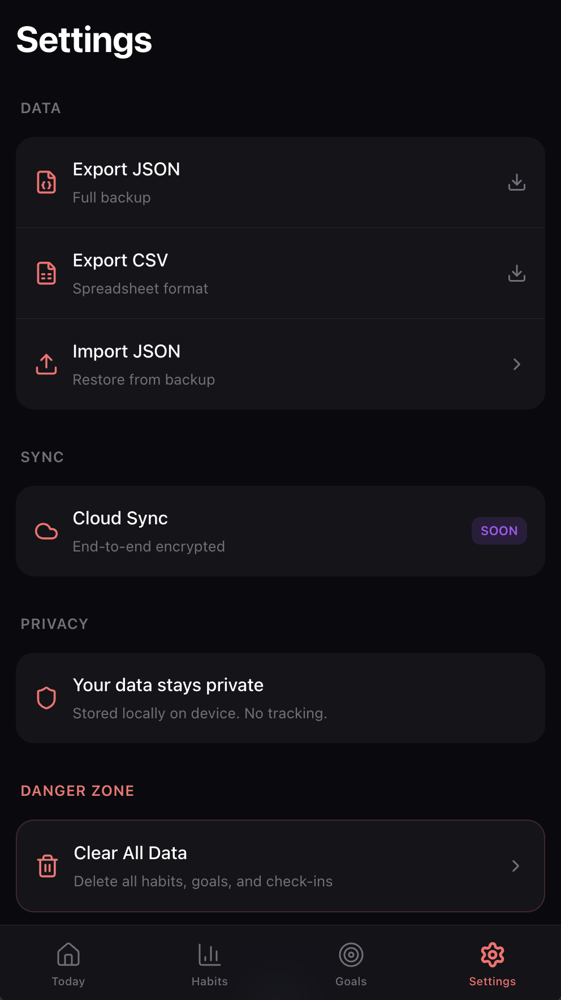

# BetterBe

**Analytics-first habit & goal tracker** — A beautiful, privacy-focused PWA that helps you build better habits through data-driven insights.



## ✨ Features

### 📊 Habit Tracking
- **Multiple habit types**: Binary (yes/no), Numeric (count), Duration (minutes), Scale (1-10)
- **Inline stepper controls** for quick numeric updates
- **Target values** with flexible goal directions (at least, at most, exactly)
- **Daily trend charts** showing your progress over time

### 🎯 Goal Management
- **Multi-habit goals** — Link multiple habits to a single goal
- **Visual sparklines** showing trend at a glance
- **Smart status indicators**: On Track, Making Progress, Losing Momentum, Just Started
- **Quick actions** for overdue goals: Mark Achieved or Extend deadline

### 📈 Analytics
- **Momentum tracking** — See if you're improving or declining
- **Streak counters** — Current and best streaks
- **Rolling averages** — 7, 14, and 30-day performance
- **Activity heatmaps** — GitHub-style visualization

### 🔒 Privacy First
- **100% local storage** — All data stays on your device
- **No accounts required** — Works immediately
- **Offline-first PWA** — Works without internet
- **Export/Import** — JSON backup, CSV for spreadsheets

## Screenshots

| Today | Habits | Goals | Settings |
|-------|--------|-------|----------|
|  |  |  |  |

## 🚀 Getting Started

### Prerequisites
- Node.js 18+
- npm or pnpm

### Installation

```bash
# Clone the repository
git clone https://github.com/piyushKumar-1/betterbe.git
cd betterbe

# Install dependencies
npm install

# Start development server
npm run dev
```

The app will be available at `http://localhost:5173`

### Build for Production

```bash
npm run build
npm run preview
```

## 🛠 Tech Stack

- **Framework**: SvelteKit 2.0 with Svelte 5 (Runes)
- **Database**: IndexedDB via Dexie.js (local-first)
- **Styling**: Custom CSS with CSS variables
- **Icons**: Lucide Svelte
- **PWA**: @vite-pwa/sveltekit

## 📱 Install as App

BetterBe is a Progressive Web App (PWA). To install:

1. Open the app in Chrome/Safari
2. Click "Add to Home Screen" or install prompt
3. Enjoy native-like experience!

## 📄 License

MIT License - feel free to use for personal or commercial projects.

---

Built with ❤️ for habit builders everywhere
